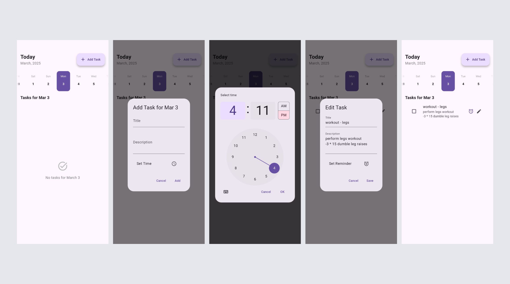

# Daily Planner App

## Overview
The **Daily Planner App** is a Flutter-based task management application that helps users organize their daily activities efficiently. It utilizes **Riverpod** for state management and **Hive** for local storage. Additionally, **Awesome Notifications** is used to send reminders for scheduled tasks.

## Screenshots


## Features
- **15-Day Planner**: Users can schedule and view tasks for the next 15 days.
- **Horizontal Date Scrolling**: Easily navigate between days using a horizontally scrollable date picker.
- **Task Management**: Add, update, delete, and mark tasks as completed.
- **Reminders & Notifications**: Get timely reminders using **Awesome Notifications**.
- **Minimal & Elegant UI**: A clean and user-friendly interface for seamless task management.

## Technologies Used
- **Flutter**: Cross-platform UI development.
- **Riverpod**: State management.
- **Hive**: Local storage for tasks.
- **Awesome Notifications**: Push notifications for task reminders.

## Installation
1. Clone the repository:
   ```bash
   git clone https://github.com/mahabubulhasibshawon/daily_planner.git
   cd daily-planner
   ```
2. Install dependencies:
   ```bash
   flutter pub get
   ```
3. Run the app:
   ```bash
   flutter run
   ```


## Contribution
Feel free to fork the repository and submit pull requests to enhance the app.

## License
This project is licensed under the **MIT License**.

